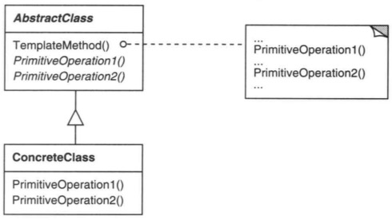

# 模板方法

## 意图

定义一个操作中的算法的骨架，而将一些步骤延迟到子类中。模板方法使得子类可以不改变一个算法的结构即可重新定义该算法的某些特定步骤。

## 解析

## 总结

又是延迟到子类，延迟意味着将实体方法抽象为接口方法，和工厂方法思路是一致的，并且和工厂方法极其相似。

两者的目的不一样，工厂方法是用于创建对象，并且没有依赖其他方法。而模板方法用于算法的，这个算法一词让我疑惑了好几年，不明白具体什么意思，现在才想明白这里所谓的算法是指一系列相关的步骤。

模板方法有多个相互依赖的方法，而某个或几个方法是容易变化的，为了应对变化，就把容易变化的方法做了抽象，这就是模板方法。

假如模板方法中存在创建对象的特定步骤，说明模板方法中使用了工厂方法，工厂方法是模板方法的子集。

