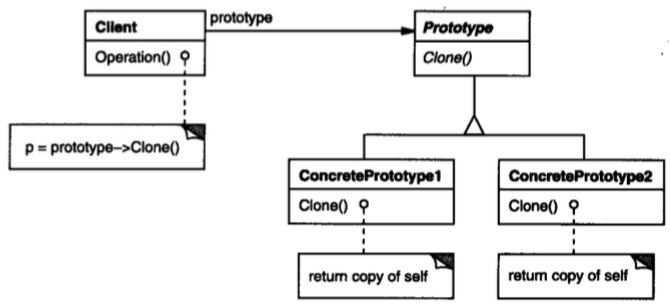

# 原型模式

## 意图

用原型实例指定创建对象的种类，并通过拷贝这些原型创建新的对象。

## 解析

## 总结

其实说白了就是给类提供一个克隆方法，可以通过克隆（内存拷贝）创建同类型的对象，成本低廉，不用关心要创建的对象类型以及如何创建对象。一般用于创建大量同类型对象的场景，如粒子系统。

需要注意的有两点：

	一、为了封装变化，需要把类抽象为接口，调用者不需要关心具体类；
	二、克隆方法需要深拷贝，如果对象组合嵌套太深就失去了原型的意义。
	

