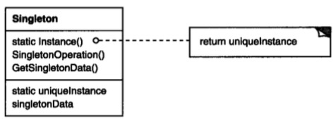

# 单件模式

## 意图

保证一个类仅有一个实例，并提供一个访问它的全局访问点。

## 解析

新学编程，犯的最常见的错误就是喜欢用全局变量，因为访问起来非常方便，而把所有的全局变量换成局部变量进行封装，并且函数嵌套较深时，明显带来的工作量比较大。

也就是说，使用全局变量比较简单、粗暴，有时还很有效。但是一旦工程变得复杂起来时，全局变量随处都可以更改，容易出错并且问题不好排查，带来的副作用就会很明显。也不是不能使用全局变量，而是需要合适的场景。比如表示全局唯一性的东西就可以使用全局变量。

全局变量引入到面向对象语言里，就是单例模式了。因为面向对象讲究个封装，用类吧全局变量一包裹可不就是单例么。



代码很简单，将构造函数私有化，不让`new`一个对象，只能通过指定的方法获取全局实例。

```java
public class Singleton {

    private Singleton() {
    }

    private static final Singleton s_instance = new Singleton();
    
    public Singleton sharedInstance() {
        return s_instance;
    }
}
```

静态成员的方式有个小问题：`如果程序中没有使用该类，静态成员依然会被创建，带来额外的内存开销`。

为了减少这种副作用，应该在使用该对象时再创建实例：

```java
public class Singleton {

    private Singleton() {
    }

    private static Singleton _instance;
    public Singleton sharedInstance() {

        if (_instance == null) {
            _instance = new Singleton();
        }

        return _instance;
    }
}
```

现在好多了，不需要的时候不会占用内存，多次使用也保持一份实例。不过还是有例外，如`多线程同时调用了sharedInstance，首次创建对象时可能会创建多份`。虽然只有一次时机，出现的概率几乎可以忽略不计，但缺陷就是缺陷。弥补的方式也简单，对该方法加锁就可以了（加锁要考虑性能开销，采用较小的加锁机制）。


## 总结

单例模式是最简单的一个模式了，需要关心的只有两点：一、构造器私有化；二、线程安全问题。

另外，由于单例模式有简单的访问方式，所以可能会造成滥用。单例有个缺点是对象一旦创建，内存占用是贯穿整个生命周期的。


